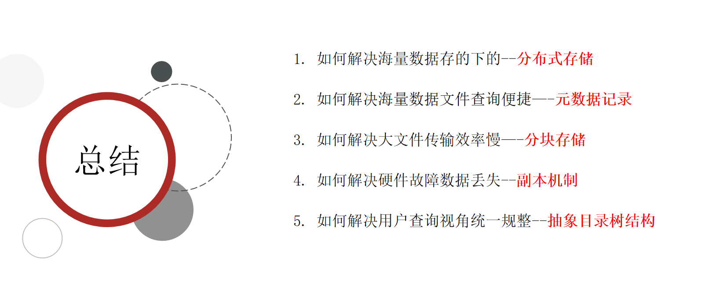

## Hadoop入门与应用开发 

[TOC]

### 企业存储系统

#### 存储架构

1. DAS存储架构

   （Direct-Attached Storage）直连式存储（Direct-Attached Storage），存储设备是通过电缆（通常是SCSI接口电缆）直接挂到服务器总线，比较依赖操作系统来进行IO操作

2. NAS网络接入存储

   （Network-Attached Storage）存储设备通过标准的网络拓扑结构(例如以太网)连接

3. SAN 存储区域网络存储

   （Storage Area Network）是一种高速的、专门用于存储操作的网络，通常独立于计算机局域网（LAN）

#### 文件系统

一种存储和组织数据的方法，使得对文件访问和查找变得容易，使用文件和树形目录，一套实现了数据的存储、分级组织、访问和获取等操作的抽象数据类型

1. 文件名

   由文件主名和扩展名组成，有特殊含义的字符，一般不允许出现在文件名中

2. 元数据

   元数据（metadata）又称之为解释性数据，记录数据的数据

##### 文件系统分类

1. 基于磁盘的文件系统

   在非易失介质上（磁盘、光盘）存储文档的经典方式，断电时数据不易丢失，Linux中可以使用df -Th查看。

2. 虚拟文件系统

   内核中生成的文件系统，内核空间和用户间之间进行通信

3. 网络文件系统（NFS，Network File System）

#### 传统缺点

1. 成本高
2. 性能低
3. 可扩展性地

解决方案 ：

1. 海量数据存储问题

   多机横向扩展   分布式存储

2. 海量数据便捷查询

   用元数据把文件和其存储的机器的位置信息记录下来

3. 传输效率慢

   分块存储：把大文件拆分成若干个小块（block 简写blk），分别存储在不同机器上，并行操作提高效率。

4. 硬件故障数据丢失

   冗余存储是个不错的选择。采用副本机制，把数据丢失的风险分散到各个机器上。

5. 解决用户查询视角统一规整

   把分布式文件系统的元数据记录这一块也抽象成统一的目录树结构。

### HDFS（ Hadoop Distributed File System ）Haddop分布式文件系统

#### HDFS设计目标

1. 硬件故障（Hardware Failure）是常态

   故障检测和自动快速恢复是HDFS的    核心架构目标

2. 流式读取数据（Streaming Data Access）

   HDFS被设计成用于批处理，注重数据访问的高吞吐量。

3. HDFS被调整成支持大文件（Large Data Sets）

4. 大部分HDFS应用对文件要求的是write-one-read-many访问模型

5. 移动计算的代价比之移动数据的代价低

   一个应用请求的计算，离它操作的数据越近就越高效。将计算移动到数据附近，比之将数据移动到应用所在显然更好

6. 方便平台间的移植

#### HDFS应用场景

大文件
数据流式访问
一次写入多次读取低成本部署，廉价PC
高容错

#### HDFS重要特性

1. 主从架构

   HDFS采用master/slave架构。一般一个HDFS集群是有一个Namenode和一定数目的Datanode组成。

2. 分块存储机制

   物理上是分块存储（block）块的大小可以通过配置参数来规定

3. 副本机制

   默认dfs.replication的值是3，也就是会额外再复制2份

4. namespace

   HDFS支持传统的层次型文件组织结构，Namenode负责维护文件系统的namespace名称空间，任何对文件系统名称空间或属性的修改都将被Namenode记录下来，HDFS会给客户端提供一个统一的抽象目录树，客户端通过路径来访问文件，形如：hdfs://namenode:port/dir-a/dir-b/dir-c/file.data

5. 元数据管理

   Namenode管理的元数据具有两种类型：

   文件自身属性信息 

   文件块位置映射信息   ：记录文件块和DataNode之间的映射信息，即哪个块位于哪个节点上

6. 数据块存储

   文件的各个block的具体存储管理由DataNode节点承担。每一个block都可以在多个DataNode上存储

