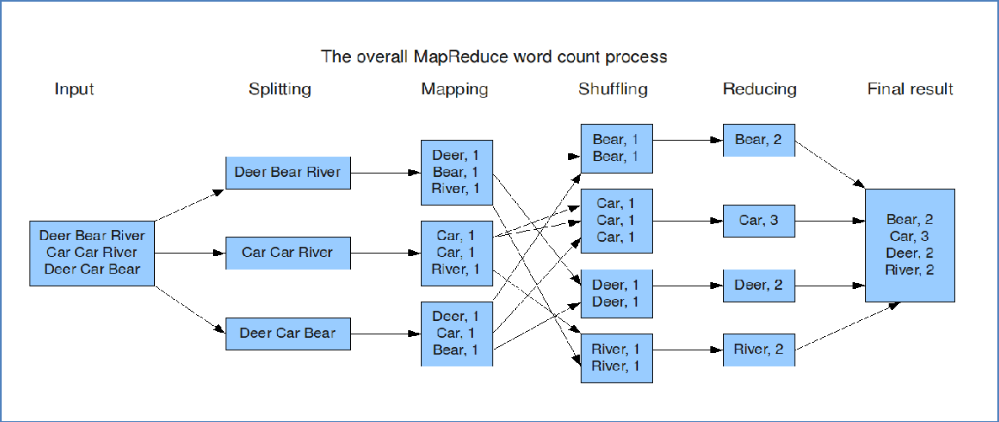

##  区分MR程序运行模式

1. 登入yarn集群查看

   XXXX:8088   查看是否有程序执行的记录

2. 通过查看执行日志

   查看job作业的编号是否有local关键字

## MR的输入输出

一直运行在<key, value>键值对上

### 输入  TextInputFormat

路径如果为文件，则运行该文件

若是为文件夹，则运行该目录下的所有文件

###  输出  TextOutputFormat

输出路径不能提前存在，否则会报错

可以优化代码，先判断输出路径是否存在，若存在，先删除

```java
FileSystem fs = FileSystem.get(conf);
if(fs.exits(new Path(args[1]))){
    fs.delete(new Pathargs[1])
}
```

## MR阶段



### Map阶段

第一阶段：把输入目录下文件按照一定的标准逐个进行逻辑切片，形成切片规划。
默认Split size = Block size，每一个切片由一个MapTask处理。（getSplits）
第二阶段：对切片中的数据按照一定的规则读取解析返回<key,value>对。
默认是按行读取数据。key是每一行的起始位置偏移量，value是本行的文本内容。（TextInputFormat）
第三阶段：调用Mapper类中的map方法处理数据。
每读取解析出来的一个<key,value> ，调用一次map方法。

第四阶段：按照一定的规则对Map输出的键值对进行分区partition。默认不分区，因为只有一个reducetask。
分区的数量就是reducetask运行的数量。
第五阶段：Map输出数据写入内存缓冲区，达到比例溢出到磁盘上。溢出spill的时候根据key进行排序sort。
默认根据key字典序排序。
第六阶段：对所有溢出文件进行最终的merge合并，成为一个文件。

### Reduce阶段

第一阶段：ReduceTask会主动从MapTask复制拉取其输出的键值对。
第二阶段：把复制到Reducer本地数据，全部进行合并merge，即把分散的数据合并成一个大的数据。再对合并后的数据排序。
第三阶段是对排序后的键值对调用reduce方法。
键相等的键值对调用一次reduce方法。最后把这些输出的键值对写入到HDFS文件中。